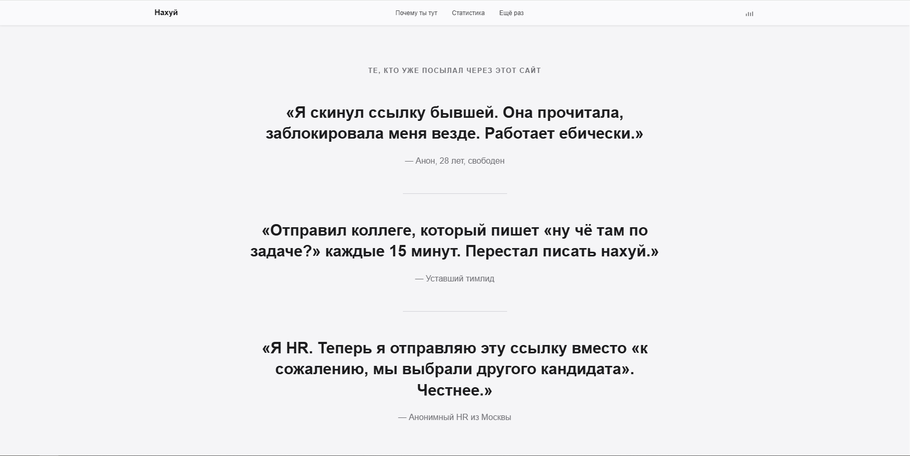

<div align="center">



# Иди нахуй.

**Самый элегантный способ послать кого-то нахуй.**

Одна ссылка. Один клик. Один посыл.

[Демо](https://nahui.crazydev.pro) · [Автор](https://github.com/x0doit) · [crazydev.pro](https://crazydev.pro)

</div>

---

## Концепция

Знаешь это чувство, когда хочется послать кого-то нахуй, но культурно, с подачей, с визуалом?

Этот сайт — **ссылка-оружие**. Ты кидаешь её человеку, он открывает — и получает полноценный, выверенный до пикселя, анимированный посыл нахуй в стилистике Apple.com. Пафосные заголовки, плавные анимации, параллакс, бесшовные переходы — и всё это чтобы сказать одну простую вещь.

> Ты заебал. Иди нахуй.

Контраст стерильного минимализма Apple и тотального русского мата создаёт тот самый эффект, ради которого стоит скинуть ссылку.

## Что внутри

- **10 секций** — от hero до футера, каждая бьёт в цель
- **Scroll-reveal анимации** — элементы плавно появляются при скролле
- **Параллакс** — заголовки двигаются с глубиной
- **Анимированные счётчики** — 0% интереса, ∞ расстояние, 24/7 похуй
- **AI-генератор посылов** — кнопка генерирует новый посыл с эффектом печатной машинки
- **Пасхалки** — кастомное контекстное меню, Konami code, детектор скорости скролла
- **3D tilt карточек** — микровзаимодействия при наведении
- **Встроенный аудиоплеер** — музыкальное сопровождение в навбаре
- **Полная мобильная адаптация** — от iPhone SE до десктопа

## Стек

| Слой | Технология |
|------|-----------|
| Backend | PHP 8.5, Apache |
| Frontend | TypeScript, vanilla |
| Сборка | esbuild |
| Стилизация | CSS (custom properties, clamp, backdrop-filter) |
| Анимации | IntersectionObserver, requestAnimationFrame |

## Структура

```
├── index.php                  # Front controller
├── .htaccess                  # Rewrite rules
├── css/
│   └── style.css              # Весь CSS
├── js/
│   └── app.js                 # Собранный бандл (gitignored)
├── nahui.mp3                  # Саундтрек
├── src/
│   ├── bootstrap.php          # Константы, автолоад
│   ├── Router.php             # Простой роутер
│   ├── View.php               # Рендер шаблонов
│   ├── controllers/
│   │   └── HomeController.php
│   ├── data/
│   │   └── content.php        # Весь контент сайта
│   └── views/
│       ├── layout.php         # Master template
│       └── partials/          # 9 секций
├── ts/
│   ├── app.ts                 # Entry point
│   ├── core/                  # rAF scheduler, Observer factory, utils
│   └── modules/               # 7 модулей анимаций и интерактива
├── package.json
└── tsconfig.json
```

## Установка

```bash
# Клонируй
git clone https://github.com/x0doit/nahui.crazydev.pro.git
cd nahui.crazydev.pro

# Установи зависимости
npm install

# Собери TypeScript
npm run build

# Для разработки (watch mode)
npm run watch
```

Направь веб-сервер (Apache/Nginx) на корень проекта. Требуется PHP 8.0+.

## Автор

**x0doit** — [GitHub](https://github.com/x0doit) · [crazydev.pro](https://crazydev.pro)

## Лицензия

[CC BY-NC 4.0](LICENSE.md) — см. файл лицензии.

Коротко:
- **Можно** — использовать, изменять, распространять в некоммерческих целях **с указанием авторства** (ссылка на [github.com/x0doit](https://github.com/x0doit))
- **Нельзя** — использовать в коммерческих целях без письменного разрешения автора
- **Нельзя** — удалять или скрывать информацию об авторе

Для коммерческого использования — пишите автору.
